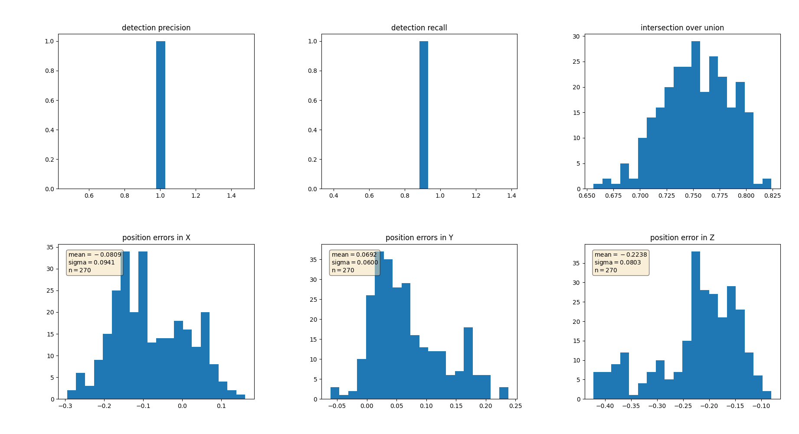

# SDCND : Sensor Fusion and Tracking

This is the project for the second course in the  [Udacity Self-Driving Car Engineer Nanodegree Program](https://www.udacity.com/course/c-plus-plus-nanodegree--nd213) : Sensor Fusion and Tracking. 

In this project, you'll fuse measurements from LiDAR and camera and track vehicles over time. You will be using real-world data from the Waymo Open Dataset, detect objects in 3D point clouds and apply an extended Kalman filter for sensor fusion and tracking.


The project consists of two major parts: 
1. **Object detection**: In this part, a deep-learning approach is used to detect vehicles in LiDAR data based on a birds-eye view perspective of the 3D point-cloud. Also, a series of performance measures is used to evaluate the performance of the detection approach. 
2. **Object tracking** : In this part, an extended Kalman filter is used to track vehicles over time, based on the lidar detections fused with camera detections. Data association and track management are implemented as well.

The following diagram contains an outline of the data flow and of the individual steps that make up the algorithm. 


Also, the project code contains various tasks, which are detailed step-by-step in the code. More information on the algorithm and on the tasks can be found in the Udacity classroom. 

## Project File Structure

📦project<br>
 ┣ 📂dataset --> contains the Waymo Open Dataset sequences <br>
 ┃<br>
 ┣ 📂misc<br>
 ┃ ┣ evaluation.py --> plot functions for tracking visualization and RMSE calculation<br>
 ┃ ┣ helpers.py --> misc. helper functions, e.g. for loading / saving binary files<br>
 ┃ ┗ objdet_tools.py --> object detection functions without student tasks<br>
 ┃ ┗ params.py --> parameter file for the tracking part<br>
 ┃ <br>
 ┣ 📂results --> binary files with pre-computed intermediate results<br>
 ┃ <br>
 ┣ 📂student <br>
 ┃ ┣ association.py --> data association logic for assigning measurements to tracks incl. student tasks <br>
 ┃ ┣ filter.py --> extended Kalman filter implementation incl. student tasks <br>
 ┃ ┣ measurements.py --> sensor and measurement classes for camera and lidar incl. student tasks <br>
 ┃ ┣ objdet_detect.py --> model-based object detection incl. student tasks <br>
 ┃ ┣ objdet_eval.py --> performance assessment for object detection incl. student tasks <br>
 ┃ ┣ objdet_pcl.py --> point-cloud functions, e.g. for birds-eye view incl. student tasks <br>
 ┃ ┗ trackmanagement.py --> track and track management classes incl. student tasks  <br>
 ┃ <br>
 ┣ 📂tools --> external tools<br>
 ┃ ┣ 📂objdet_models --> models for object detection<br>
 ┃ ┃ ┃<br>
 ┃ ┃ ┣ 📂darknet<br>
 ┃ ┃ ┃ ┣ 📂config<br>
 ┃ ┃ ┃ ┣ 📂models --> darknet / yolo model class and tools<br>
 ┃ ┃ ┃ ┣ 📂pretrained --> copy pre-trained model file here<br>
 ┃ ┃ ┃ ┃ ┗ complex_yolov4_mse_loss.pth<br>
 ┃ ┃ ┃ ┣ 📂utils --> various helper functions<br>
 ┃ ┃ ┃<br>
 ┃ ┃ ┗ 📂resnet<br>
 ┃ ┃ ┃ ┣ 📂models --> fpn_resnet model class and tools<br>
 ┃ ┃ ┃ ┣ 📂pretrained --> copy pre-trained model file here <br>
 ┃ ┃ ┃ ┃ ┗ fpn_resnet_18_epoch_300.pth <br>
 ┃ ┃ ┃ ┣ 📂utils --> various helper functions<br>
 ┃ ┃ ┃<br>
 ┃ ┗ 📂waymo_reader --> functions for light-weight loading of Waymo sequences<br>
 ┃<br>
 ┣ basic_loop.py<br>
 ┣ loop_over_dataset.py<br>


## Installation Instructions for Running Locally
### Cloning the Project
In order to create a local copy of the project, please click on "Code" and then "Download ZIP". Alternatively, you may of-course use GitHub Desktop or Git Bash for this purpose. 

### Python
The project has been written using Python 3.7. Please make sure that your local installation is equal or above this version. 

### Package Requirements
All dependencies required for the project have been listed in the file `requirements.txt`. You may either install them one-by-one using pip or you can use the following command to install them all at once: 
`pip3 install -r requirements.txt` 

### Waymo Open Dataset Reader
The Waymo Open Dataset Reader is a very convenient toolbox that allows you to access sequences from the Waymo Open Dataset without the need of installing all of the heavy-weight dependencies that come along with the official toolbox. The installation instructions can be found in `tools/waymo_reader/README.md`. 

### Waymo Open Dataset Files
This project makes use of three different sequences to illustrate the concepts of object detection and tracking. These are: 
- Sequence 1 : `training_segment-1005081002024129653_5313_150_5333_150_with_camera_labels.tfrecord`
- Sequence 2 : `training_segment-10072231702153043603_5725_000_5745_000_with_camera_labels.tfrecord`
- Sequence 3 : `training_segment-10963653239323173269_1924_000_1944_000_with_camera_labels.tfrecord`

To download these files, you will have to register with Waymo Open Dataset first: [Open Dataset – Waymo](https://waymo.com/open/terms), if you have not already, making sure to note "Udacity" as your institution.

Once you have done so, please [click here](https://console.cloud.google.com/storage/browser/waymo_open_dataset_v_1_2_0_individual_files) to access the Google Cloud Container that holds all the sequences. Once you have been cleared for access by Waymo (which might take up to 48 hours), you can download the individual sequences. 

The sequences listed above can be found in the folder "training". Please download them and put the `tfrecord`-files into the `dataset` folder of this project.


### Pre-Trained Models
The object detection methods used in this project use pre-trained models which have been provided by the original authors. They can be downloaded [here](https://drive.google.com/file/d/1Pqx7sShlqKSGmvshTYbNDcUEYyZwfn3A/view?usp=sharing) (darknet) and [here](https://drive.google.com/file/d/1RcEfUIF1pzDZco8PJkZ10OL-wLL2usEj/view?usp=sharing) (fpn_resnet). Once downloaded, please copy the model files into the paths `/tools/objdet_models/darknet/pretrained` and `/tools/objdet_models/fpn_resnet/pretrained` respectively.

### Using Pre-Computed Results

In the main file `loop_over_dataset.py`, you can choose which steps of the algorithm should be executed. If you want to call a specific function, you simply need to add the corresponding string literal to one of the following lists: 

- `exec_data` : controls the execution of steps related to sensor data. 
  - `pcl_from_rangeimage` transforms the Waymo Open Data range image into a 3D point-cloud
  - `load_image` returns the image of the front camera

- `exec_detection` : controls which steps of model-based 3D object detection are performed
  - `bev_from_pcl` transforms the point-cloud into a fixed-size birds-eye view perspective
  - `detect_objects` executes the actual detection and returns a set of objects (only vehicles) 
  - `validate_object_labels` decides which ground-truth labels should be considered (e.g. based on difficulty or visibility)
  - `measure_detection_performance` contains methods to evaluate detection performance for a single frame

In case you do not include a specific step into the list, pre-computed binary files will be loaded instead. This enables you to run the algorithm and look at the results even without having implemented anything yet. The pre-computed results for the mid-term project need to be loaded using [this](https://drive.google.com/drive/folders/1-s46dKSrtx8rrNwnObGbly2nO3i4D7r7?usp=sharing) link. Please use the folder `darknet` first. Unzip the file within and put its content into the folder `results`.

- `exec_tracking` : controls the execution of the object tracking algorithm

- `exec_visualization` : controls the visualization of results
  - `show_range_image` displays two LiDAR range image channels (range and intensity)
  - `show_labels_in_image` projects ground-truth boxes into the front camera image
  - `show_objects_and_labels_in_bev` projects detected objects and label boxes into the birds-eye view
  - `show_objects_in_bev_labels_in_camera` displays a stacked view with labels inside the camera image on top and the birds-eye view with detected objects on the bottom
  - `show_tracks` displays the tracking results
  - `show_detection_performance` displays the performance evaluation based on all detected 
  - `make_tracking_movie` renders an output movie of the object tracking results

Even without solving any of the tasks, the project code can be executed. 

The final project uses pre-computed lidar detections in order for all students to have the same input data. If you use the workspace, the data is prepared there already. Otherwise, [download the pre-computed lidar detections](https://drive.google.com/drive/folders/1IkqFGYTF6Fh_d8J3UjQOSNJ2V42UDZpO?usp=sharing) (~1 GB), unzip them and put them in the folder `results`.

## External Dependencies
Parts of this project are based on the following repositories: 
- [Simple Waymo Open Dataset Reader](https://github.com/gdlg/simple-waymo-open-dataset-reader)
- [Super Fast and Accurate 3D Object Detection based on 3D LiDAR Point Clouds](https://github.com/maudzung/SFA3D)
- [Complex-YOLO: Real-time 3D Object Detection on Point Clouds](https://github.com/maudzung/Complex-YOLOv4-Pytorch)


## License
[License](LICENSE.md)


# Self-Driving Car Beta Testing Nanodegree 

This is a template submission for the midterm second course in the  [Udacity Self-Driving Car Engineer Nanodegree Program](https://www.udacity.com/course/c-plus-plus-nanodegree--nd213) : 3D Object Detection (Midterm). 


## 3D Object detection

We have used the [Waymo Open Dataset's](https://console.cloud.google.com/storage/browser/waymo_open_dataset_v_1_2_0_individual_files) real-world data and used 3d point cloud for lidar based object detection. 

- Configuring the ranges channel to 8 bit and view the range /intensity image (ID_S1_EX1)
- Use the Open3D library to display the lidar point cloud on a 3d viewer and identifying 10 images from point cloud.(ID_S1_EX2)
- Create Birds Eye View perspective (BEV) of the point cloud,assign lidar intensity values to BEV,normalize the heightmap of each BEV (ID_S2_EX1,ID_S2_EX2,ID_S2_EX3)
- In addition to YOLO, use the [repository](https://review.udacity.com/github.com/maudzung/SFA3D) and add parameters ,instantiate fpn resnet model(ID_S3_EX1)
- Convert BEV coordinates into pixel coordinates and convert model output to bounding box format  (ID_S3_EX2)
- Compute intersection over union, assign detected objects to label if IOU exceeds threshold (ID_S4_EX1)
- Compute false positives and false negatives, precision and recall(ID_S4_EX2,ID_S4_EX3)


The project can be run by running 

```
python loop_over_dataset.py
```

All codes runned in python3.10 enviroment and also, I faceed a issue with installation of pytorch. I the requrement.txt file, I needed to hange its name, also I need to install some other dependecies for wxwidget. 


```python
sudo apt-get update
sudo apt-get install build-essential libgtk-3-dev libnotify-dev freeglut3 freeglut3-dev libjpeg-dev libtiff-dev libsdl2-dev libgstreamer-plugins-base1.0-dev libwebkit2gtk-4.0-dev libsm-dev libxt-dev
```
by this prompt, I could install the wxwidget dependencies.

## Step-1: Compute Lidar point cloud from Range Image

In this we are first previewing the range image and convert range and intensity channels to 8 bit format. After that, we use the openCV library to stack the range and intensity channel vertically to visualize the image.

- Convert "range" channel to 8 bit
- Convert "intensity" channel to 8 bit
- Crop range image to +/- 90 degrees  left and right of forward facing x axis
- Stack up range and intensity channels vertically in openCV

The changes are made in 'loop_over_dataset.py'
data_filename = 'training_segment-1005081002024129653_5313_150_5333_150_with_camera_labels.tfrecord
show_only_frames = [0, 1]

exec_data = []  (in the course this parameter is writen but I realize that this isnt used in any line)

exec_detection = []

exec_tracking = []

exec_visualization = ['show_range_image']

The changes are made in "objdet_pcl.py"

I changed and completed the show_range_image.

The range image sample:


For the next part, we use the Open3D library to display the lidar point cloud datas
- Visualize the point cloud in Open3D
- Some examples from point cloud  with varying degrees of visibility

The changes are made in "objdet_pcl.py" The changes are within show_pcl, show_range_image, bev_from_pcl methods.

Point cloud images


## Step-2: Creaate BEV from Lidar PCL

In this case, we are doing:
- Converting the coordinates to pixel values
- Assigning lidar intensity values to the birds eye view BEV mapping
- Using sorted and pruned point cloud lidar from the  previous task
- Normalizing the height map in the BEV
- Compute and map the intensity values

steps ...

The changes are in the 'loop_over_dataset.py' related to provided information by udacity course.

Also, There are some changes in "object_cpl.py". 

A sample preview of the BEV:


A preview of the intensity layer:

The 'lidar_pcl_top' is used in this case, shown in the Figures:

The corresponding intensity channel:


The corresponding normalized height channel:


## Step-3: Model Based Object Detection in BEV Image

Here we are using the cloned [repo](https://github.com/maudzung/SFA3D) ,particularly the test.py file  and extracting the relevant configurations from 'parse_test_configs()'  and added them in the 'load_configs_model' config structure.

- Instantiating the fpn resnet model from the cloned repository configs
- Extracting 3d bounding boxes from the responses
- Transforming the pixel to vehicle coordinates
- Model output tuned to the bounding box format [class-id, x, y, z, h, w, l, yaw]

The changes are in "loop_over_dataset.py"

The changes for the detection are inside the "objdet_detect.py" file:

these lines and function have been addedinto the script:


```python
def apply_sigmoid_to_outputs(outputs):
    outputs['hm_cen'] = _sigmoid(outputs['hm_cen'])
    outputs['cen_offset'] = _sigmoid(outputs['cen_offset'])
    return outputs 

def generate_detections(outputs, num_detections=1):
    # Decoding the outputs to get detections. Parameters are passed as needed.
    detections = decode(outputs['hm_cen'], outputs['cen_offset'], outputs['direction'], outputs['z_coor'],
                                outputs['dim'], K=num_detections)
    return detections

def process_detections(detections, configs):
    # Convert to CPU, numpy, and apply post processing.
    detections = detections.cpu().numpy().astype(np.float32)
    detections = post_processing(detections, configs)
    detections = detections[0][1]
    return detections

elif 'fpn_resnet' in configs.arch:
  # decode output and perform post-processing
  
  ####### ID_S3_EX1-5 START #######     
  #######
  print("student task ID_S3_EX1-5")
  outputs = apply_sigmoid_to_outputs(outputs)
  detections = generate_detections(outputs, num_detections=40)
  detections = process_detections(detections, configs)
  print(detections)
  #######
  ####### ID_S3_EX1-5 END #######  
```

The detected objects will be returned with coordinates and properties in the BEV coordinate space. Thus, before the detections can move along in the processing pipeline, they need to be converted into metric coordinates in vehicle space.

A sample preview of the bounding box images:


## Step-4: Performance detection for 3D Object Detection

In this step, the performance is computed by getting the IOU  between labels and detections to get the false positive and false negative values.The task is to compute the geometric overlap between the bounding boxes of labels and the detected objects:

- Assigning a detected object to a label if IOU exceeds threshold
- Computing the degree of geometric overlap
- For multiple matches objects/detections pair with maximum IOU are kept
- Computing the false negative and false positive values
- Computing precision and recall over the false positive and false negative values

The changes for "objdet_eval.py" where the precision and recall are calculated as functions of false positives and negatives:




The precision recall curve is plotted showing similar results of precision = 0.94 and recall=0.96

In the next step, we set the 
```python
configs_det.use_labels_as_objects=True
```
 which results in precision and recall values as 1.This is shown in the following image:


## step-5: Tracking results
In this step, 3D object detection and camera-lidar fusion outputs are evaluated by management code (assocaiton.py, trackmanagement.py and filter.py)

# Project Instructions Step 1
In this step, we only track one object which moves from front of ego vehicle to back. In the student/filter.py file predict() F(), Q(), update(), gamma() and S() funcstioan were implemented.

```python
  def F(self):
        ############
        # TODO Step 1: implement and return system matrix F
        ############
        n = self.dim_state  
        F = np.eye(n)  
        
        for i in range(3):
            F[i, i + 3] = self.dt  

        print("state matrix is completed")

        return np.matrix(F)
        
        ############
        # END student code
        ############ 
```
```python
    def Q(self):
        ############
        # TODO Step 1: implement and return process noise covariance Q
        ############
        dt = self.dt
        q = self.q
        q3 = (q/3) * dt**3
        q2 = (q/2) * dt**2
        q1 = q * dt

        Q = np.matrix([
            [q3, 0.0, 0.0, q2, 0.0, 0.0],
            [0.0, q3, 0.0, 0.0, q2, 0.0],
            [0.0, 0.0, q3, 0.0, 0.0, q2],
            [q2, 0.0, 0.0, q1, 0.0, 0.0],
            [0.0, q2, 0.0, 0.0, q1, 0.0],
            [0.0, 0.0, q2, 0.0, 0.0, q1]
        ])
        return Q
```
```python
  def predict(self, track):
        ############
        # TODO Step 1: predict state x and estimation error covariance P to next timestep, save x and P in track
        ############

        # Compute the state transition matrix and process noise covariance matrix
        F = self.F()
        Q = self.Q()
        
        # Predict the next state using the linear motion model assumption
        x_predicted = F @ track.x  # Using @ for matrix multiplication
        
        # Predict the next covariance matrix incorporating process noise
        P_predicted = F @ track.P @ F.T + Q  # Using @ for matrix multiplication and .T for transpose
        
        # Update the track object with the new predicted state and covariance
        track.set_x(x_predicted)
        track.set_P(P_predicted)

        print("prediction step is completed")
        
        ############
        # END student code
        ############ 
```
```python
    def update(self, track, meas):
        ############
        # TODO Step 1: update state x and covariance P with associated measurement, save x and P in track
        ############
        try:
            # Measurement matrix from sensor model
            H = meas.sensor.get_H(track.x)
            
            # Calculate the residual between the predicted state and the measurement
            gamma = self.gamma(track, meas)
            
            # Calculate the covariance of the residual
            S = self.S(track, meas, H)
            
            # Compute the Kalman gain
            K = track.P @ H.T @ np.linalg.inv(S)
            
            # Update the state estimate with the new measurement
            x_updated = track.x + K @ gamma
            
            # Update the error covariance estimate
            I = np.identity(self.dim_state)  # Identity matrix of the same dimension as the state
            P_updated = (I - K @ H) @ track.P
            
            # Set the updated state and covariance in the track object
            track.set_x(x_updated)
            track.set_P(P_updated)
            
            # Optionally update other attributes based on the measurement
            track.update_attributes(meas)

            print("update step is completed")
        
        except Exception as e:
            logging.error("Unable to update the state and covariance: {}".format(e))
        ############
        # END student code
        ############ 
```
```python
    def gamma(self, track, meas):
        ############
        # TODO Step 1: calculate and return residual gamma
        ############        
        try:
            # Calculate the expected measurement from the current state estimate
            expected_measurement = meas.sensor.get_hx(track.x)
            
            # Compute the residual
            residual = meas.z - expected_measurement
            
            return residual
        
        except Exception as e:
            logging.error(f"Error in computing the residual: {e}")
            raise
        
        ############
        # END student code
        ############ 
```
```python
    def S(self, track, meas, H):
        ############
        # TODO Step 1: calculate and return covariance of residual S
        ############
        s = H * track.P * H.transpose() + meas.R # covariance of residual
        return s
        
        ############
        # END student code
        ############ 
```

first image shows initial state of the target when tracking system is initialized.


after the target is confirmed, it is look like this image


## Project Instructions Step 2
In Step 2 of the final project, I implemented the track management to initialize and delete tracks, set a track state and a track score. This task involves writing code within the file student/trackmanagement.py

* Set show_only_frames = [65, 100] in order to limit the sequence to frames 65 to 100. 
* Set configs_det.lim_y = [-5, 15] to limit the y-range and remove other targets left and right of our target.

```python
  def __init__(self, meas, id):
        print(f'Creating track no. {id}')
        self.id = id

        # Extract the rotation matrix from the sensor to vehicle coordinates
        Rot = meas.sensor.sens_to_veh[0:3, 0:3]

        # Initialize position in homogeneous coordinates and transform it to vehicle coordinates
        pos_sens = np.ones((4, 1))
        pos_sens[0:3] = meas.z[0:3]
        pos_veh = meas.sensor.sens_to_veh @ pos_sens  # Using @ for matrix multiplication

        # Initialize state vector with position (from sensor to vehicle coordinates) and zero velocity
        self.x = np.zeros((6, 1))
        self.x[0:3] = pos_veh[0:3]

        # Compute the position covariance component
        P_pos = Rot @ meas.R @ Rot.T  # Rotate the measurement covariance

        # Initialize velocity covariance with predefined parameters
        P_vel = np.diag([params.sigma_p44**2, params.sigma_p55**2, params.sigma_p66**2])

        # Construct the overall covariance matrix
        self.P = np.zeros((6, 6))
        self.P[0:3, 0:3] = P_pos
        self.P[3:6, 3:6] = P_vel

        # Initialize state and score
        self.state = 'initialized'
        self.score = 1 / params.window

        # Additional track attributes derived from measurements and transformations
        self.width = meas.width
        self.length = meas.length
        self.height = meas.height
        # Transform yaw from sensor to vehicle coordinates
        self.yaw = np.arccos(Rot[0, 0] * np.cos(meas.yaw) + Rot[0, 1] * np.sin(meas.yaw))
        self.t = meas.t

        # Logging successful initialization
        logging.info(f'Track {self.id} initialized with state {self.state} and score {self.score}')
```

```python
    def manage_tracks(self, unassigned_tracks, unassigned_meas, meas_list):  
        ############
        # TODO Step 2: implement track management:
        
        # Decrease score for unassigned tracks
        for i in unassigned_tracks:
            track = self.track_list[i]
            # Check if the sensor has the track in its field of view (FOV)
            if meas_list and meas_list[0].sensor.in_fov(track.x):
                track.state = 'tentative'
                # Ensure score does not exceed a defined maximum threshold
                track.score = min(track.score, params.delete_threshold + 1)
                # Decrease score based on the defined window parameter
                track.score -= 1 / params.window
        
        # Delete tracks if they meet the criteria for deletion
        # self.track_list = [
        #     track for track in self.track_list if not (
        #         track.score <= params.delete_threshold and
        #         (track.P[0, 0] >= params.max_P or track.P[1, 1] >= params.max_P)
        #     )
        # ]
                
        #delete old track    
        for track in self.track_list:
            if (track.state == 'confirmed' and track.score <= params.delete_threshold) or track.P[0, 0] >= params.max_P or track.P[1, 1] >= params.max_P:
                self.delete_track(track)

        # Initialize new tracks from unassigned measurements using only lidar data
        for j in unassigned_meas:
            if meas_list[j].sensor.name == 'lidar':
                self.init_track(meas_list[j])
```

```python
  def handle_updated_track(self, track):      
        ############
        # TODO Step 2: implement track management for updated tracks:
        # Increment the track score proportionally based on the window parameter
        track.score += 1. / params.window

        # Update the state based on the score compared to a predefined threshold
        if track.score > params.confirmed_threshold:
            track.state = 'confirmed'
        else:
            track.state = 'tentative'

        # Log state change for debugging and monitoring
        logging.info(f"Track {track.id} updated: Score = {track.score:.2f}, State = {track.state}")
            

        
        ############
        # END student code
        ############ 
```
Note that: gating_threshold_lidar parameter is set as 1.9 in this step otherwise the target cannot be confirmed.


## Project Instructions Step 3
In Step 3 of the final project, I implemented a single nearest neighbor data association to associate measurements to tracks. I finally tried multi target tracking now! This task involves writing code within the file student/association.py

* Select Sequence 1 (training_segment-1005081002024129653_5313_150_5333_150_with_camera_labels.tfrecord) 
* Set show_only_frames = [0, 200] in order to use the whole sequence now
* Set configs_det.lim_y = [-25, 25] to use the whole y-range including several targets

```python
def associate(self, track_list, meas_list, KF):
             
        ############
        # TODO Step 3: association:
        # Initialize the association matrix
        association_matrix = []

        # Reset unassigned lists
        self.unassigned_tracks = list(range(len(track_list)))  # Index list of unassigned tracks
        self.unassigned_meas = list(range(len(meas_list)))     # Index list of unassigned measurements

        # Populate the association matrix with Mahalanobis distances or infinity where gating fails
        for track in track_list:
            track_distances = []
            for meas in meas_list:
                MHD = self.MHD(track, meas, KF)  # Compute Mahalanobis Distance
                if self.gating_ok(MHD, meas.sensor):  # Check if the distance is within the gate
                    track_distances.append(MHD)
                else:
                    track_distances.append(np.inf)  # Use infinity where gating condition fails
            association_matrix.append(track_distances)

        # Update the association matrix as a numpy matrix
        self.association_matrix = np.matrix(association_matrix)

        # Logging association matrix creation
        logging.info("Association matrix updated and unassigned lists reset.")
```

```python
    def gating_ok(self, MHD, sensor): 
        ############
        # TODO Step 3: return True if measurement lies inside gate, otherwise False
        ############
        df = None
        gate_val = None
        df = sensor.dim_meas
        if sensor.name == 'lidar':
            #While fine tuning the algorihm, we find that it's better to have a larger gate threshold for lidar 
            #which means current lidar noise is a bit underestimated
            gate_val = params.gating_threshold_lidar
        
        if sensor.name == 'camera':
            gate_val = params.gating_threshold
            
        x= MHD * MHD
        per = chi2.cdf(x, df)
        if sensor.name == 'lidar':
            print("lidar chisqr = {}".format(per))
        if per <  gate_val:
            return True
        else:
            return False
```

```python
def get_closest_track_and_meas(self):
        ############
        # TODO Step 3: find closest track and measurement:
        A = self.association_matrix

        # Check if all entries are infinite, indicating no valid associations
        if np.min(A) == np.inf:
            return np.nan, np.nan

        # Find indices of the minimum entry in the association matrix
        ij_min = np.unravel_index(np.argmin(A, axis=None), A.shape)
        ind_track = ij_min[0]
        ind_meas = ij_min[1]

        # Retrieve the track and measurement index from the unassigned lists
        track_id = self.unassigned_tracks[ind_track]
        meas_id = self.unassigned_meas[ind_meas]

        # Remove the selected track and measurement from the unassigned lists
        self.unassigned_tracks.remove(track_id)
        self.unassigned_meas.remove(meas_id)

        # Delete the corresponding row and column from the association matrix
        self.association_matrix = np.delete(A, ind_track, axis=0)
        self.association_matrix = np.delete(self.association_matrix, ind_meas, axis=1)

        return track_id, meas_id  
```
```python
def MHD(self, track, meas, KF):
        ############s
        # TODO Step 3: calculate and return Mahalanobis distance
        ############
        z = np.matrix(meas.z)
        z_pred = meas.sensor.get_hx(track.x)
        y = z - z_pred 
        S = meas.R
        
        d = math.sqrt(y.T * S.I * y)
        
        
        return d
        
        ############
        # END student code
        ############ 
```
Note that: because of the wrong detections some of the RMSE was measured as too high, however, track0, track1 and track7 are validated targets to be tracked.


## Project Instructions Step 4
In Step 4 of the final project, I implemented the nonlinear camera measurement model. I finally completed the sensor fusion module for camera-lidar fusion. This task involves writing code within the file student/measurements.py.

* The settings are the same as for Step 3.

```python
def in_fov(self, x):
        # check if an object x can be seen by this sensor
        ############
        # TODO Step 4: implement a function that returns True if x lies in the sensor's field of view, 
        
        # Ensure x is in homogeneous coordinates
        pos_veh = np.ones((4, 1))
        pos_veh[0:3] = x[0:3] 

        # Transform from vehicle to sensor coordinates
        pos_sens = self.veh_to_sens @ pos_veh
        x, y, z = np.squeeze(pos_sens.A)[:3]  # Extract the Cartesian coordinates

        # Calculate the angle of the point relative to the sensor
        angle = math.atan2(y, x)

        # Check if the angle is within the sensor's horizontal field of view
        return self.fov[0] <= angle <= self.fov[1]
            
        ############
        # END student code
        ############ 
```

```python 
  def get_hx(self, x):    
        # # calculate nonlinear measurement expectation value h(x)  
            
        #     ############
        #     # TODO Step 4: implement nonlinear camera measurement function h:

        pos_veh = np.ones((4, 1))
        pos_veh[0:3] = x[0:3]

        # Transform from vehicle to sensor coordinates
        pos_sens = self.veh_to_sens @ pos_veh

        if self.name == 'lidar':
            # For LiDAR, return the first three coordinates directly
            return pos_sens[0:3]
        elif self.name == 'camera':
            x, y, z = pos_sens[0], pos_sens[1], pos_sens[2]

            # Project from camera coordinates to image coordinates
            if x <= 0:
                # Avoid division by zero; choose a method to handle this situation, like raising an error
                raise ValueError("Projection not possible: x-coordinate in camera frame is zero or negative.")
            else:
                # Image plane projection using camera's intrinsic parameters
                u = self.c_i - self.f_i * y / x
                v = self.c_j - self.f_j * z / x
                z_pred = np.array([u, v])

            # Return as a column vector
            return z_pred.reshape(-1, 1)
            
        
        ############
        # END student code
        ############ 
```

```python
  def get_H(self, x):
        # calculate Jacobian H at current x from h(x)
        H = np.matrix(np.zeros((self.dim_meas, params.dim_state)))
        R = self.veh_to_sens[0:3, 0:3] # rotation
        T = self.veh_to_sens[0:3, 3] # translation
        if self.name == 'lidar':
            H[0:3, 0:3] = R
        elif self.name == 'camera':
            # check and print error message if dividing by zero
            if R[0,0]*x[0] + R[0,1]*x[1] + R[0,2]*x[2] + T[0] == 0: 
                raise NameError('Jacobian not defined for this x!')
            else:
                H[0,0] = self.f_i * (-R[1,0] / (R[0,0]*x[0] + R[0,1]*x[1] + R[0,2]*x[2] + T[0])
                                    + R[0,0] * (R[1,0]*x[0] + R[1,1]*x[1] + R[1,2]*x[2] + T[1]) \
                                        / ((R[0,0]*x[0] + R[0,1]*x[1] + R[0,2]*x[2] + T[0])**2))
                H[1,0] = self.f_j * (-R[2,0] / (R[0,0]*x[0] + R[0,1]*x[1] + R[0,2]*x[2] + T[0])
                                    + R[0,0] * (R[2,0]*x[0] + R[2,1]*x[1] + R[2,2]*x[2] + T[2]) \
                                        / ((R[0,0]*x[0] + R[0,1]*x[1] + R[0,2]*x[2] + T[0])**2))
                H[0,1] = self.f_i * (-R[1,1] / (R[0,0]*x[0] + R[0,1]*x[1] + R[0,2]*x[2] + T[0])
                                    + R[0,1] * (R[1,0]*x[0] + R[1,1]*x[1] + R[1,2]*x[2] + T[1]) \
                                        / ((R[0,0]*x[0] + R[0,1]*x[1] + R[0,2]*x[2] + T[0])**2))
                H[1,1] = self.f_j * (-R[2,1] / (R[0,0]*x[0] + R[0,1]*x[1] + R[0,2]*x[2] + T[0])
                                    + R[0,1] * (R[2,0]*x[0] + R[2,1]*x[1] + R[2,2]*x[2] + T[2]) \
                                        / ((R[0,0]*x[0] + R[0,1]*x[1] + R[0,2]*x[2] + T[0])**2))
                H[0,2] = self.f_i * (-R[1,2] / (R[0,0]*x[0] + R[0,1]*x[1] + R[0,2]*x[2] + T[0])
                                    + R[0,2] * (R[1,0]*x[0] + R[1,1]*x[1] + R[1,2]*x[2] + T[1]) \
                                        / ((R[0,0]*x[0] + R[0,1]*x[1] + R[0,2]*x[2] + T[0])**2))
                H[1,2] = self.f_j * (-R[2,2] / (R[0,0]*x[0] + R[0,1]*x[1] + R[0,2]*x[2] + T[0])
                                    + R[0,2] * (R[2,0]*x[0] + R[2,1]*x[1] + R[2,2]*x[2] + T[2]) \
                                        / ((R[0,0]*x[0] + R[0,1]*x[1] + R[0,2]*x[2] + T[0])**2))
        return H   
```

```python
def generate_measurement(self, num_frame, z, meas_list):
        # generate new measurement from this sensor and add to measurement list
        ############
        # TODO Step 4: remove restriction to lidar in order to include camera as well
        ############
        
#         if self.name == 'lidar':
        meas = Measurement(num_frame, z, self)
        meas_list.append(meas)
        return meas_list
        
        ############
        # END student code
        ############ 
```

```python
  elif sensor.name == 'camera':
            
      ############
      # TODO Step 4: initialize camera measurement including z, R, and sensor 
      ############
      # self.z = np.zeros((sensor.dim_meas,1)) # measurement vector
      # self.z[0][0] = z[0]
      # self.z[1][0] = z[1]
      # self.sensor = sensor # sensor that generated this measurement
      # sigma_cam_i = params.sigma_cam_i
      # sigma_cam_j = params.sigma_cam_j
      # self.R = np.matrix([[sigma_cam_i**2, 0], # measurement noise covariance matrix
      #                     [0, sigma_cam_j**2]])

      # pass
      if len(z) < 2:
          raise ValueError("Insufficient measurement data provided for camera initialization.")

      # Initialize measurement vector with dimensions specified by sensor
      self.z = np.zeros((sensor.dim_meas, 1))
      
      # Assign measurement values ensuring no out-of-bound errors
      self.z[0, 0] = z[0]
      self.z[1, 0] = z[1]

      # Associate this measurement with the sensor
      self.sensor = sensor

      # Retrieve noise standard deviations from parameters
      sigma_cam_i = params.sigma_cam_i
      sigma_cam_j = params.sigma_cam_j

      # Initialize measurement noise covariance matrix
      self.R = np.matrix([[sigma_cam_i**2, 0],
                          [0, sigma_cam_j**2]])
  
      ############
      # END student code
      ############ 
```

RMSE values for track 0, track2 and track 7 are betwwen 0.0 - 0.2.
Note that: because of the wrong detection one of the rmse was measured as too high. If use_labels_as_objects is set as False


If use_labels_as_objects is set as True


### initial state looks like this image


### next frames look like this


## Summary of Lidar based 3D Object Detection and Multo Object Tracking

For stable tracking, it's crucial to utilize lidar technology. Transforming range data into point clouds via spatial volumes or through points, along with employing convolutional neural networks, is vital for subsequent analyses. Leveraging networks such as ResNet or DarkNet alongside YOLO is key for translating complex point cloud data into recognizable object detections with bounding boxes. To gauge the efficacy of Lidar-based detection, employing maximum Intersection Over Union (IOU) mapping, mean Average Precision (mAP), and illustrating the precision and recall of the bounding boxes is fundamental.

## References
Inspired by https://github.com/mithul12/midterm-sensor-fusion and https://github.com/udacity/nd013-c2-fusion-starter repositories.